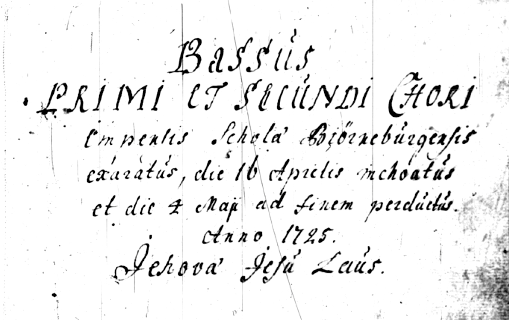

# Porin triviaalikoulun nuottikirja

Osa Porin triviaalikoulun nuottikirjasta (1725) puhtaaksi kirjoittettuna kirjana. Tämän edition on rekonstruoinut Johannes Vesterinen ja puhtaaksikirjoittanut Yrjö Kari-Koskinen.

PDF-muotoiset nuotit löytyvät sivulta https://triviaalikoulu.sonusborealis.fi

Korjauksia ja täydennyksiä otetaan kernaasti vastaan. Varmistathan, että et käytä lähteenä tekijänoikeuden alaisia editioita (esim. Piae Cantiones -julkaisut).

## Lähteet

- [Porin triviaalikoulun ääni- eli stemmakirjat – JYX/Nuottijulkaisut](https://jyx.jyu.fi/handle/123456789/19464):
 1. [Discantus](https://jyx.jyu.fi/dspace/handle/123456789/18957)
 2. [Altus](https://jyx.jyu.fi/dspace/handle/123456789/18955)
 3. [Tenor](https://jyx.jyu.fi/dspace/handle/123456789/18958)
 4. [Bassus](https://jyx.jyu.fi/dspace/handle/123456789/18956)
- [Piae Cantiones](http://www.lillhannus.net/piae-cantiones/), edition © Mats Lillhannus, lupa käyttää lähteenä
- [Psalm-singende Und Lobgesäng-spielende Kirche Christi In Des H. Röm. Reichs](https://books.google.fi/books?id=_IbEDNe32scC&lpg=PA64&ots=gOW-IaE6Rp&hl=fi&pg=PA64#v=onepage&q&f=true), lähteenä _Lobt Gott ihr Christen alle_ -kappaleen sanoituksessa

## Kirjan latominen

Kirja on ladottu [LilyPond](http://lilypond.org/)- ja [XeLaTeX](http://xetex.sourceforge.net/)-ladontaohjelmilla. XeLaTeXin sijaan voit käyttää myös PDFLaTeX-ohjelmaa.

Yksittäiset kappaleet löytyvät `songs`-hakemiston alta ja ne voi latoa itsenäisesti LilyPondilla itsenäisiksi PDF-tiedostoiksi.

Ladonnan voi suorittaa `make`-komennolla:
* `make` tai `make triviaalikoulu.pdf` – latoo koko kirjan
* `make parts` – latoo yksittäisten kappaleiden nuotit ja midi-tiedostot erikseen kullekin stemmalle (ja erillisille kuoroille monikuoroteoksissa)
* `make all` – latoo sekä kirjan, erilliset nuotit että html-sivun
* `make clean` – poistaa kaikki ladotut tiedostot
* `make index.html` - latoo html-sivun, jossa on linkit kaikkiin yksittäisten kappaleiden nuotteihin ja midi-stemmoihin

## Sisällys

1. Ætas carmen melodiæ (à 4) – säveltäjä: Daniel Friderici (1584-1638), suomenkieliset sanat: Hemminki Maskulainen (n. 1550–1619)
1. Anima mea expectat Dominum (à 8) – säveltäjä: Friedrich Weissensee (1560-1622)
2. Christe tibi vivo (à 4) – säveltäjä tuntematon
3. Christus adest justus (à 4) – säveltäjä tuntematon
4. Christus factus est pro nobis (à 4) – säveltäjä tuntematon
4. Ecce quam (à 4) – säveltäjä tuntematon
5. Gaude et laetare (à 4) – säveltäjä tuntematon
6. Gloria et honore (à 8) – säveltäjä: Jacobus Gallus (1550–1591)
7. Gud wälsigna thetta huus (à 4) – säveltäjä tuntematon
8. I Herrans Tienare (à 5) – säveltäjä tuntematon
8. Jucundare jugiter (à 4) – säveltäjä: Daniel Friderici, suomenkieliset sanat: Hemminki Maskulainen
9. Laus tibi Christe (à 4) – säveltäjä tuntematon
9. Lobt Gott ihr Christen alle (à 5) – säveltäjä tuntematon
9. Nunc Zymphonizate (à 5) – säveltäjä: Giovanni Gastoldi (n. 1554–1609)
10. Susanna se, videns (à 4) – säveltäjä: Didier Lupi (n. 1520–1560)

## Kappaleet työn alla

Seuraavat kappaleet on rekonstruoitu ja tarkoitus kirjoittaa puhtaaksi.
- Repleatur os meum
- Cedit hiems eminus
- Veni Sancte Spiritus (longum) à 5
- Veni Sancte Spiritus (sovitus JV)
- Veni Sancte Spiritus (originaali)
- Si Angelus de coelo
* Ainoan Jumalan korkeudes'
* Omnes gentes plaudite manibus
* Mens confisa Deo
* Ah Jesu mellitissime

## Lisenssi

Tämä teos on lisensoitu [Creative Commons Nimeä-JaaSamoin 3.0 (CC BY-SA 3.0)](https://creativecommons.org/licenses/by-sa/3.0/deed.fi) -ehdoin.
